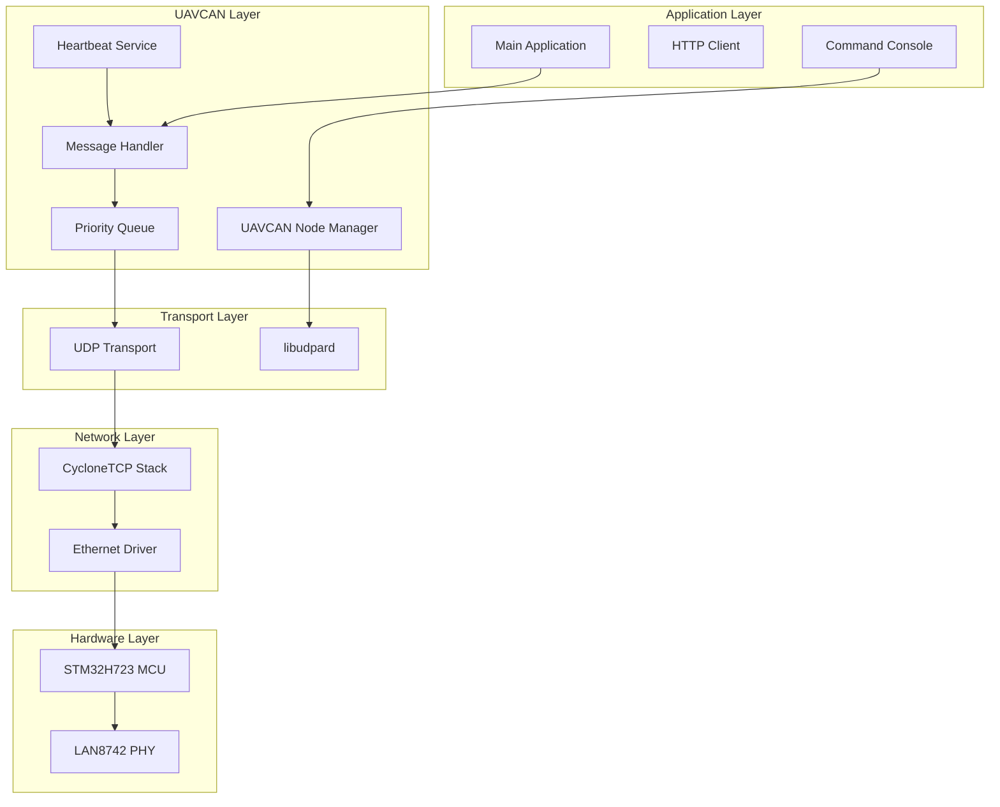

# Design Document

## Overview

This design document outlines the integration of UAVCAN/DroneCAN protocol support into the existing STM32H723 CycloneTCP test platform. The design leverages the existing libudpard library and CycloneTCP stack to provide a complete UAVCAN/DroneCAN node implementation while maintaining compatibility with existing functionality.

The architecture follows a modular approach with dedicated tasks for UAVCAN operations, proper thread synchronization, and integration with the existing command console system for configuration and monitoring.

## Architecture

### High-Level Architecture



### Task Architecture

The system will use the following FreeRTOS tasks with appropriate priorities:

1. **Network Task** (Priority: High) - CycloneTCP stack operations
2. **UAVCAN Node Task** (Priority: Medium-High) - Core UAVCAN node management
3. **UAVCAN TX Task** (Priority: Medium-High) - Message transmission with priority handling
4. **UAVCAN RX Task** (Priority: Medium) - Message reception and processing
5. **Heartbeat Task** (Priority: Low-Medium) - Periodic heartbeat transmission
6. **Command Console Tasks** (Priority: Low-Medium) - Existing console functionality

## Components and Interfaces

### UAVCAN Node Manager

**Purpose:** Central coordination of UAVCAN node operations

**Key Functions:**
- Node initialization and configuration
- Dynamic node ID allocation
- Node status management
- Integration with transport layer

**Interface:**
```c
typedef struct {
    uint8_t node_id;
    UdpardNodeID* dynamic_node_id;
    bool initialized;
    uint32_t uptime_sec;
    UavcanNodeHealth health;
    UavcanNodeMode mode;
} UavcanNodeContext;

error_t uavcanNodeInit(UavcanNodeContext* ctx, uint8_t node_id);
error_t uavcanNodeStart(UavcanNodeContext* ctx);
error_t uavcanNodeStop(UavcanNodeContext* ctx);
UavcanNodeHealth uavcanNodeGetHealth(const UavcanNodeContext* ctx);
```

### Message Handler

**Purpose:** UAVCAN message serialization, deserialization, and routing

**Key Functions:**
- Message creation and parsing
- Subject ID management
- Message validation
- Integration with priority queue

**Interface:**
```c
typedef struct {
    uint32_t subject_id;
    uint8_t priority;              // 0-7 priority levels per Cyphal spec
    size_t payload_size;
    uint8_t* payload;
    uint64_t timestamp_usec;
    uint8_t source_node_id;
    uint8_t destination_node_id;   // For service requests/responses
} UavcanMessage;

error_t uavcanMessageCreate(UavcanMessage* msg, uint32_t subject_id, 
                           uint8_t priority, const void* payload, size_t size);
error_t uavcanMessageSend(const UavcanMessage* msg);
error_t uavcanMessageReceive(UavcanMessage* msg, uint32_t timeout_ms);
bool uavcanMessageValidatePriority(uint8_t priority);
```

### Priority Queue Manager

**Purpose:** Implement UAVCAN/Cyphal UDP priority handling with 8 priority levels

**Key Functions:**
- Message queuing by priority (8 levels as per Cyphal specification section 4.1.1.3)
- Priority-based transmission scheduling
- Queue management and overflow handling
- Support for all 8 Cyphal priority levels (0-7, where 0 is highest priority)

**Interface:**
```c
#define CYPHAL_PRIORITY_LEVELS 8
#define CYPHAL_PRIORITY_EXCEPTIONAL 0  // Highest priority
#define CYPHAL_PRIORITY_IMMEDIATE    1
#define CYPHAL_PRIORITY_FAST         2
#define CYPHAL_PRIORITY_HIGH         3
#define CYPHAL_PRIORITY_NOMINAL      4  // Default priority
#define CYPHAL_PRIORITY_LOW          5
#define CYPHAL_PRIORITY_SLOW         6
#define CYPHAL_PRIORITY_OPTIONAL     7  // Lowest priority

typedef struct {
    QueueHandle_t priority_queues[CYPHAL_PRIORITY_LEVELS];
    SemaphoreHandle_t queue_mutex;
    uint32_t queue_depths[CYPHAL_PRIORITY_LEVELS];
    uint32_t overflow_counts[CYPHAL_PRIORITY_LEVELS];
} UavcanPriorityQueue;

error_t uavcanPriorityQueueInit(UavcanPriorityQueue* pq);
error_t uavcanPriorityQueuePush(UavcanPriorityQueue* pq, const UavcanMessage* msg);
error_t uavcanPriorityQueuePop(UavcanPriorityQueue* pq, UavcanMessage* msg);
uint8_t uavcanPriorityQueueGetNextPriority(const UavcanPriorityQueue* pq);
```

### Heartbeat Service

**Purpose:** Periodic heartbeat message transmission

**Key Functions:**
- Configurable heartbeat interval
- Health status reporting
- Automatic heartbeat generation

**Interface:**
```c
typedef struct {
    uint32_t interval_ms;
    bool enabled;
    TaskHandle_t task_handle;
    UavcanNodeContext* node_ctx;
} UavcanHeartbeatService;

error_t uavcanHeartbeatInit(UavcanHeartbeatService* hb, UavcanNodeContext* node_ctx);
error_t uavcanHeartbeatStart(UavcanHeartbeatService* hb);
error_t uavcanHeartbeatSetInterval(UavcanHeartbeatService* hb, uint32_t interval_ms);
```

### UDP Transport Integration

**Purpose:** Bridge between UAVCAN and CycloneTCP UDP

**Key Functions:**
- UDP socket management
- Multicast group handling
- Thread-safe network access
- Integration with libudpard

**Interface:**
```c
typedef struct {
    Socket* udp_socket;
    IpAddr multicast_addr;
    uint16_t port;
    SemaphoreHandle_t socket_mutex;
    UdpardInstance udpard_instance;
} UavcanUdpTransport;

error_t uavcanUdpTransportInit(UavcanUdpTransport* transport);
error_t uavcanUdpTransportSend(UavcanUdpTransport* transport, 
                              const void* data, size_t size);
error_t uavcanUdpTransportReceive(UavcanUdpTransport* transport, 
                                 void* buffer, size_t* size);
```

### Command Console Integration

**Purpose:** Extend existing console with UAVCAN commands

**New Commands:**
- `uavcan status` - Display node status and statistics
- `uavcan config node-id <id>` - Set node ID
- `uavcan config heartbeat <interval>` - Set heartbeat interval
- `uavcan send test <subject-id> <data>` - Send test message
- `uavcan monitor <on|off>` - Enable/disable message monitoring
- `uavcan nodes` - List discovered nodes

## Data Models

### Node Configuration

```c
typedef struct {
    uint8_t node_id;                    // Node ID (0 for dynamic allocation)
    uint32_t heartbeat_interval_ms;     // Heartbeat interval in milliseconds
    uint16_t udp_port;                  // UDP port for UAVCAN traffic
    char multicast_addr[16];            // Multicast address string
    bool monitor_enabled;               // Message monitoring flag
    uint8_t log_level;                  // Logging verbosity level
} UavcanConfig;
```

### Message Statistics

```c
typedef struct {
    uint32_t messages_sent;
    uint32_t messages_received;
    uint32_t send_errors;
    uint32_t receive_errors;
    uint32_t queue_overflows;
    uint64_t last_heartbeat_time;
    uint32_t discovered_nodes_count;
    uint32_t messages_sent_by_priority[CYPHAL_PRIORITY_LEVELS];
    uint32_t messages_received_by_priority[CYPHAL_PRIORITY_LEVELS];
    uint32_t queue_overflows_by_priority[CYPHAL_PRIORITY_LEVELS];
} UavcanStatistics;
```

### Node Information

```c
typedef struct {
    uint8_t node_id;
    UavcanNodeHealth health;
    UavcanNodeMode mode;
    uint64_t last_seen_time;
    uint32_t uptime_sec;
    char name[64];
} UavcanNodeInfo;
```

## Error Handling

### Error Categories

1. **Initialization Errors**
   - Network interface not ready
   - UDP socket creation failure
   - Memory allocation failure
   - Invalid configuration parameters

2. **Runtime Errors**
   - Message transmission failure
   - Network connectivity loss
   - Queue overflow conditions
   - Message parsing errors

3. **Configuration Errors**
   - Invalid node ID
   - Invalid heartbeat interval
   - Invalid network parameters

### Error Handling Strategy

- Use error codes for all function returns
- Implement graceful degradation for non-critical errors
- Log errors with appropriate severity levels
- Provide recovery mechanisms where possible
- Maintain system stability even with UAVCAN subsystem failures

### Error Recovery

```c
typedef enum {
    UAVCAN_ERROR_NONE = 0,
    UAVCAN_ERROR_INIT_FAILED,
    UAVCAN_ERROR_NETWORK_UNAVAILABLE,
    UAVCAN_ERROR_SEND_FAILED,
    UAVCAN_ERROR_RECEIVE_FAILED,
    UAVCAN_ERROR_QUEUE_FULL,
    UAVCAN_ERROR_INVALID_CONFIG,
    UAVCAN_ERROR_TIMEOUT
} UavcanError;

// Error recovery function
error_t uavcanRecoverFromError(UavcanError error_code);
```

## Testing Strategy

### Unit Testing

1. **Message Handler Tests**
   - Message serialization/deserialization
   - Subject ID validation
   - Priority assignment

2. **Priority Queue Tests**
   - Priority ordering verification
   - Queue overflow handling
   - Thread safety validation

3. **Transport Layer Tests**
   - UDP socket operations
   - Multicast functionality
   - Thread synchronization

### Integration Testing

1. **Network Stack Integration**
   - Concurrent TCP/IP and UAVCAN traffic
   - Resource sharing validation
   - Performance impact assessment

2. **Console Integration**
   - Command parsing and execution
   - Status reporting accuracy
   - Configuration persistence

### System Testing

1. **Interoperability Testing**
   - Communication with other UAVCAN nodes
   - Standard message compliance
   - Network discovery functionality

2. **Performance Testing**
   - Message throughput measurement
   - Latency analysis
   - Resource utilization monitoring

3. **Reliability Testing**
   - Long-term operation stability
   - Error recovery validation
   - Network disruption handling

### Test Environment Setup

- Use UAVCAN GUI tool for network monitoring
- Set up multiple test nodes for interoperability
- Implement automated test scripts for regression testing
- Use network simulation tools for stress testing

## Implementation Considerations

### Thread Safety

- All shared resources protected by mutexes or semaphores
- CycloneTCP stack access synchronized
- Message queues implemented with thread-safe FreeRTOS primitives

### Memory Management

- Static allocation preferred for predictable behavior
- Dynamic allocation limited to initialization phase
- Memory pool usage for message buffers
- Proper cleanup on error conditions

### Performance Optimization

- Minimize memory copies in message handling
- Use efficient data structures for priority queues
- Optimize critical path operations
- Consider DMA usage for network operations

### Configuration Management

- Runtime configuration through console commands
- Configuration validation before application
- Default values for all parameters
- Configuration persistence (future enhancement)

This design provides a robust foundation for UAVCAN/DroneCAN integration while maintaining compatibility with existing functionality and ensuring proper resource management in the embedded environment.