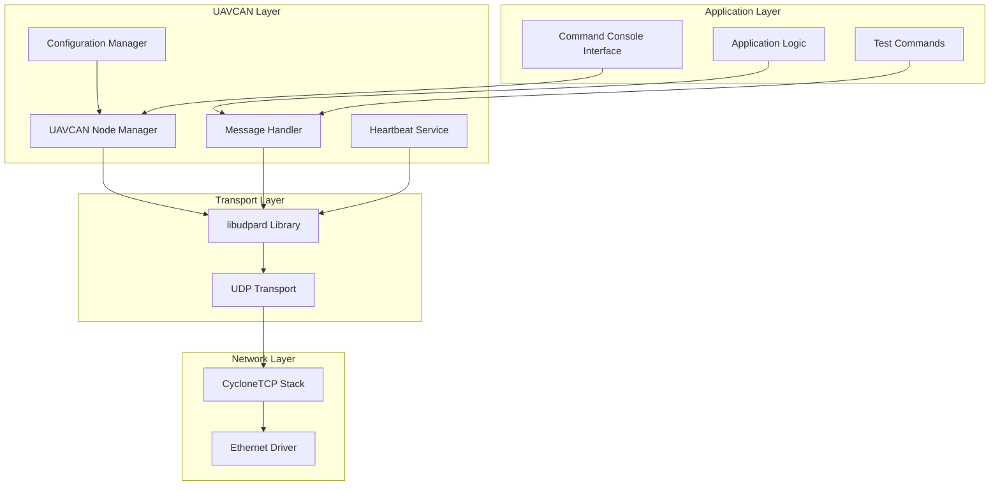

# UAVCAN/DroneCAN Integration Design Document

## Overview

This design document outlines the integration of UAVCAN/DroneCAN protocol support into the existing STM32H723 CycloneTCP test platform. The implementation will create a complete UAVCAN node that can participate in UAVCAN networks over UDP transport while maintaining compatibility with existing functionality.

The design leverages the existing libudpard library (already present in `Middlewares/Third_Party/libudpard/`) and integrates with the CycloneTCP stack to provide UDP transport. The implementation follows a modular approach with clear separation of concerns between UAVCAN protocol handling, network transport, and application interfaces.

## Architecture

### High-Level Architecture



### Task Architecture

The UAVCAN integration will introduce new FreeRTOS tasks that integrate with the existing task structure:

- **UAVCAN Main Task**: Core UAVCAN node management and message processing
- **UAVCAN Heartbeat Task**: Periodic heartbeat transmission
- **UAVCAN RX Task**: UDP message reception and processing
- **Integration with existing tasks**: Command console, Telnet, and Serial tasks

## Components and Interfaces

### 1. UAVCAN Node Manager (`uavcan_node.h/c`)

**Responsibilities:**
- Node initialization and configuration
- Dynamic node ID allocation
- Node state management
- Integration with CycloneTCP UDP sockets

**Key Functions:**
```c
typedef struct {
    UdpardInstance udpard_instance;
    Socket* udp_socket;
    uint16_t node_id;
    uint8_t node_health;
    uint8_t node_mode;
    bool initialized;
    OsMutex mutex;
} UavcanNode;

error_t uavcanNodeInit(UavcanNode* node, NetInterface* interface);
error_t uavcanNodeStart(UavcanNode* node);
error_t uavcanNodeStop(UavcanNode* node);
error_t uavcanNodeSetNodeId(UavcanNode* node, uint16_t node_id);
```

### 2. Message Handler (`uavcan_messages.h/c`)

**Responsibilities:**
- Message serialization/deserialization
- Message routing and processing
- Priority-based message queuing
- Integration with libudpard

**Key Functions:**
```c
typedef struct {
    UdpardTransferID transfer_id;
    UdpardPriority priority;
    UdpardPortID subject_id;
    size_t payload_size;
    void* payload_data;
} UavcanMessage;

error_t uavcanMessageSend(UavcanNode* node, const UavcanMessage* message);
error_t uavcanMessageReceive(UavcanNode* node, UavcanMessage* message, systime_t timeout);
error_t uavcanMessageSubscribe(UavcanNode* node, UdpardPortID subject_id);
error_t uavcanMessageUnsubscribe(UavcanNode* node, UdpardPortID subject_id);
```

### 3. Heartbeat Service (`uavcan_heartbeat.h/c`)

**Responsibilities:**
- Periodic heartbeat message transmission
- Node health status reporting
- Configurable heartbeat intervals

**Key Functions:**
```c
typedef struct {
    UavcanNode* node;
    systime_t interval_ms;
    OsTaskId task_id;
    bool running;
} UavcanHeartbeat;

error_t uavcanHeartbeatInit(UavcanHeartbeat* heartbeat, UavcanNode* node);
error_t uavcanHeartbeatStart(UavcanHeartbeat* heartbeat);
error_t uavcanHeartbeatStop(UavcanHeartbeat* heartbeat);
error_t uavcanHeartbeatSetInterval(UavcanHeartbeat* heartbeat, systime_t interval_ms);
```

### 4. Configuration Manager (`uavcan_config.h/c`)

**Responsibilities:**
- Runtime parameter configuration
- Configuration validation
- Parameter persistence (optional)

**Key Functions:**
```c
typedef struct {
    uint16_t node_id;
    uint16_t udp_port;
    uint32_t multicast_base;
    systime_t heartbeat_interval_ms;
    bool debug_enabled;
} UavcanConfig;

error_t uavcanConfigInit(UavcanConfig* config);
error_t uavcanConfigValidate(const UavcanConfig* config);
error_t uavcanConfigApply(UavcanNode* node, const UavcanConfig* config);
```

### 5. Command Line Interface (`uavcan_cli.h/c`)

**Responsibilities:**
- Console command registration
- UAVCAN-specific CLI commands
- Integration with existing FreeRTOS+CLI

**Key Commands:**
- `uavcan-init [node_id]`: Initialize UAVCAN node
- `uavcan-status`: Display node status and statistics
- `uavcan-send <subject_id> <data>`: Send test message
- `uavcan-monitor [on|off]`: Enable/disable message monitoring
- `uavcan-config <param> <value>`: Configure parameters

### 6. UDP Transport Layer (`uavcan_transport.h/c`)

**Responsibilities:**
- UDP socket management
- Multicast group management
- Integration with CycloneTCP
- Thread-safe socket operations

**Key Functions:**
```c
typedef struct {
    Socket* socket;
    NetInterface* interface;
    uint16_t local_port;
    bool multicast_enabled;
    OsMutex socket_mutex;
} UavcanTransport;

error_t uavcanTransportInit(UavcanTransport* transport, NetInterface* interface);
error_t uavcanTransportSend(UavcanTransport* transport, const UdpardUDPIPEndpoint* endpoint, 
                           const void* data, size_t size);
error_t uavcanTransportReceive(UavcanTransport* transport, void* buffer, size_t buffer_size, 
                              size_t* received_size, systime_t timeout);
```

## Data Models

### UAVCAN Message Structure

```c
typedef struct {
    struct {
        UdpardPriority priority;
        UdpardNodeID source_node_id;
        UdpardNodeID destination_node_id;
        UdpardPortID subject_id;
        UdpardTransferID transfer_id;
    } header;
    
    struct {
        size_t size;
        void* data;
    } payload;
    
    struct {
        systime_t timestamp;
        uint32_t crc;
    } metadata;
} UavcanMessageFrame;
```

### Node State Structure

```c
typedef enum {
    UAVCAN_NODE_STATE_UNINITIALIZED,
    UAVCAN_NODE_STATE_INITIALIZING,
    UAVCAN_NODE_STATE_OPERATIONAL,
    UAVCAN_NODE_STATE_ERROR,
    UAVCAN_NODE_STATE_OFFLINE
} UavcanNodeState;

typedef struct {
    UavcanNodeState state;
    uint16_t node_id;
    uint8_t health;
    uint8_t mode;
    uint32_t uptime_sec;
    uint32_t messages_sent;
    uint32_t messages_received;
    uint32_t errors_count;
} UavcanNodeStatus;
```

## Error Handling

### Error Categories

1. **Initialization Errors**
   - Network interface not ready
   - UDP socket creation failure
   - Memory allocation failure
   - Invalid configuration parameters

2. **Runtime Errors**
   - Message transmission failures
   - Socket errors
   - Memory exhaustion
   - Protocol violations

3. **Recovery Strategies**
   - Automatic retry with exponential backoff
   - Graceful degradation (disable non-critical features)
   - Error logging and reporting
   - Node restart capability

### Error Reporting

```c
typedef enum {
    UAVCAN_ERROR_NONE = 0,
    UAVCAN_ERROR_INIT_FAILED,
    UAVCAN_ERROR_SOCKET_ERROR,
    UAVCAN_ERROR_MEMORY_ERROR,
    UAVCAN_ERROR_INVALID_PARAM,
    UAVCAN_ERROR_TIMEOUT,
    UAVCAN_ERROR_PROTOCOL_ERROR
} UavcanError;

typedef struct {
    UavcanError code;
    const char* description;
    systime_t timestamp;
    const char* function;
    int line;
} UavcanErrorInfo;
```

## Testing Strategy

### Unit Testing

1. **Component Testing**
   - Individual module functionality
   - Message serialization/deserialization
   - Configuration validation
   - Error handling paths

2. **Integration Testing**
   - UAVCAN-CycloneTCP integration
   - Multi-task synchronization
   - Memory management
   - Socket operations

### System Testing

1. **Functional Testing**
   - Node initialization and discovery
   - Message transmission and reception
   - Heartbeat functionality
   - Command line interface

2. **Performance Testing**
   - Message throughput
   - Latency measurements
   - Memory usage
   - CPU utilization

3. **Interoperability Testing**
   - Communication with other UAVCAN nodes
   - Standard message types
   - Service requests/responses
   - Network topology discovery

### Test Infrastructure

```c
typedef struct {
    bool enabled;
    uint32_t test_message_count;
    systime_t test_interval_ms;
    UdpardPortID test_subject_id;
    bool simulate_errors;
} UavcanTestConfig;

// Test command functions
error_t uavcanTestSendMessages(UavcanNode* node, uint32_t count);
error_t uavcanTestMeasureLatency(UavcanNode* node, systime_t* latency_ms);
error_t uavcanTestStressTest(UavcanNode* node, uint32_t duration_sec);
```

## Memory Management

### Memory Allocation Strategy

1. **Static Allocation**
   - Core data structures
   - Task stacks
   - Configuration parameters

2. **Dynamic Allocation**
   - Message payloads
   - Temporary buffers
   - libudpard internal structures

3. **Memory Pools**
   - Pre-allocated message buffers
   - Reduced fragmentation
   - Predictable memory usage

### Memory Requirements

- **Static Memory**: ~8KB for core structures
- **Dynamic Memory**: ~16KB for message buffers and queues
- **Stack Memory**: ~4KB per UAVCAN task
- **Total Estimated**: ~32KB additional RAM usage

## Thread Safety and Synchronization

### Synchronization Mechanisms

1. **Mutexes**
   - Node state protection
   - Socket access synchronization
   - Configuration updates

2. **Queues**
   - Inter-task message passing
   - Asynchronous message processing
   - Priority-based scheduling

3. **Semaphores**
   - Resource counting
   - Task synchronization
   - Event signaling

### Critical Sections

- UDP socket operations
- libudpard instance access
- Message queue operations
- Configuration updates

## Integration Points

### Existing System Integration

1. **CycloneTCP Integration**
   - Reuse existing network interface
   - Share UDP socket resources
   - Maintain thread safety

2. **Command Console Integration**
   - Add UAVCAN-specific commands
   - Maintain existing CLI structure
   - Support both Serial and Telnet interfaces

3. **Task Management**
   - Integrate with existing FreeRTOS tasks
   - Appropriate task priorities
   - Resource sharing coordination

### Configuration Integration

The UAVCAN subsystem will integrate with the existing configuration through:
- Compile-time configuration in header files
- Runtime configuration through CLI commands
- Integration with existing network configuration

## Performance Considerations

### Optimization Strategies

1. **Message Processing**
   - Zero-copy message handling where possible
   - Efficient serialization/deserialization
   - Priority-based message queuing

2. **Network Operations**
   - Asynchronous UDP operations
   - Batch message processing
   - Efficient multicast handling

3. **Memory Usage**
   - Memory pool allocation
   - Buffer reuse strategies
   - Minimal dynamic allocation

### Performance Targets

- **Message Latency**: < 10ms for high-priority messages
- **Throughput**: > 1000 messages/second
- **CPU Usage**: < 10% additional CPU load
- **Memory Overhead**: < 32KB additional RAM usage